## 了解 Three.js

- Three.js 是基于原生 WebGL 封装运行的三维引擎。
- github 链接：https://github.com/mrdoob/three.js
- Three.js 官网：https://threejs.org/
- 主文件 Three.js-master

  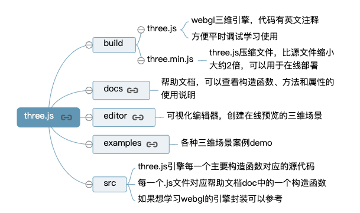

- 相关库
  - Physijs
  - stats.js
  - dat.gui
  - tween.js
  - ThreeBSP

## Three.js 快速入门

### 第一个 3D 场景

```
<!DOCTYPE html>
<html lang="en">

<head>
  <meta charset="UTF-8">
  <title>第一个three.js文件_WebGL三维场景</title>
  <style>
    body {
      margin: 0;
      overflow: hidden;
      /* 隐藏body窗口区域滚动条 */
    }
  </style>
  <!--引入three.js三维引擎-->
  <script src="http://www.yanhuangxueyuan.com/versions/threejsR92/build/three.js"></script>
  <!-- <script src="./three.js"></script> -->
  <!-- <script src="http://www.yanhuangxueyuan.com/threejs/build/three.js"></script> -->
</head>

<body>
  <script>
    /**
     * 创建场景对象Scene
     */
    var scene = new THREE.Scene();
    /**
     * 创建网格模型
     */
    // var geometry = new THREE.SphereGeometry(60, 40, 40); //创建一个球体几何对象
    var geometry = new THREE.BoxGeometry(100, 100, 100); //创建一个立方体几何对象Geometry
    var material = new THREE.MeshLambertMaterial({
      color: 0x0000ff
    }); //材质对象Material
    var mesh = new THREE.Mesh(geometry, material); //网格模型对象Mesh
    scene.add(mesh); //网格模型添加到场景中
    /**
     * 光源设置
     */
    //点光源
    var point = new THREE.PointLight(0xffffff);
    point.position.set(400, 200, 300); //点光源位置
    scene.add(point); //点光源添加到场景中
    //环境光
    var ambient = new THREE.AmbientLight(0x444444);
    scene.add(ambient);
    // console.log(scene)
    // console.log(scene.children)
    /**
     * 相机设置
     */
    var width = window.innerWidth; //窗口宽度
    var height = window.innerHeight; //窗口高度
    var k = width / height; //窗口宽高比
    var s = 200; //三维场景显示范围控制系数，系数越大，显示的范围越大
    //创建相机对象
    var camera = new THREE.OrthographicCamera(-s * k, s * k, s, -s, 1, 1000);
    camera.position.set(200, 300, 200); //设置相机位置
    camera.lookAt(scene.position); //设置相机方向(指向的场景对象)
    /**
     * 创建渲染器对象
     */
    var renderer = new THREE.WebGLRenderer();
    renderer.setSize(width, height);//设置渲染区域尺寸
    renderer.setClearColor(0xb9d3ff, 1); //设置背景颜色
    document.body.appendChild(renderer.domElement); //body元素中插入canvas对象
    //执行渲染操作   指定场景、相机作为参数
    renderer.render(scene, camera);
  </script>
</body>
</html>
```

- 几何体 Geometry

```
//创建一个立方体几何对象Geometry
var geometry = new THREE.BoxGeometry(100, 100, 100);
```

- 材质 Material

```
var material=new THREE.MeshLambertMaterial({color:0x0000ff});
```

- 光源 Light

```
var point=new THREE.PointLight(0xffffff);
```

- 相机 Camera

```
var camera = new THREE.OrthographicCamera(-s * k, s * k, s, -s, 1, 1000);
```

- 程序的结构

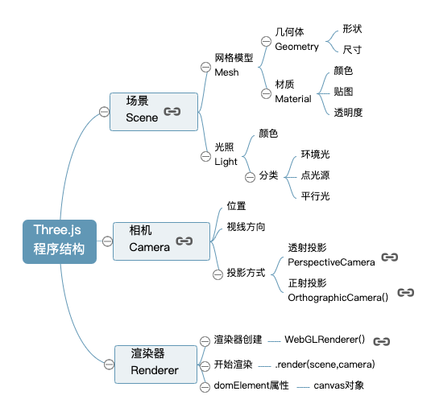

- 场景——相机——渲染器

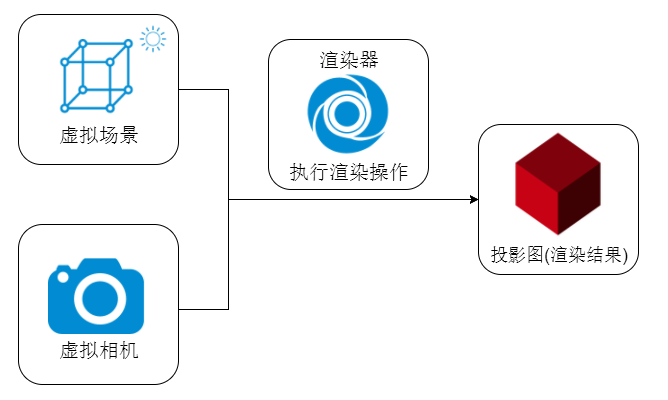

- 对象、方法和属性（面向对象编程，构造函数创建对象，对象拥有方法和属性）

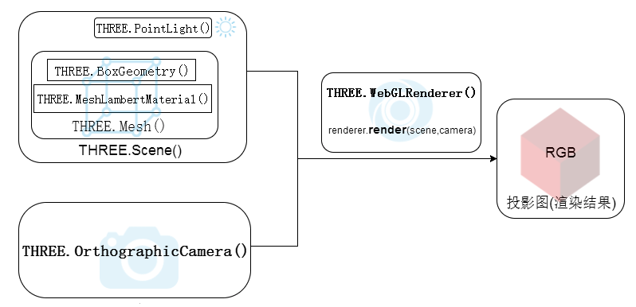

- WebGL 封装（顶点数据的处理，GPU 渲染管线的基本功能单元，算法部分）

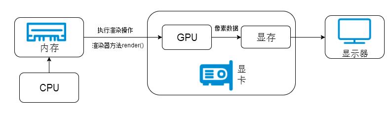

### 旋转动画、requestAnimationFrame 周期性渲染

- 周期性渲染

```
// 渲染函数
function render() {
    renderer.render(scene,camera);//执行渲染操作
    mesh.rotateY(0.01);//每次绕y轴旋转0.01弧度
}
//间隔20ms周期性调用函数fun,20ms也就是刷新频率是50FPS(1s/20ms)，每秒渲染50次
setInterval(render(), 20);
```

- 函数 requestAnimationFrame()

```
// 实际开发中，为了更好的利用浏览器渲染，可以使用函数requestAnimationFrame()代替setInterval()函数
function render() {
        renderer.render(scene,camera);//执行渲染操作
        mesh.rotateY(0.01);//每次绕y轴旋转0.01弧度
        requestAnimationFrame(render);//请求再次执行渲染函数render
    }
render();
```

- 均匀旋转

```
let T0 = new Date();//上次时间
function render() {
        let T1 = new Date();//本次时间
        let t = T1-T0;//时间差
        T0 = T1;//把本次时间赋值给上次时间
        requestAnimationFrame(render);
        renderer.render(scene,camera);//执行渲染操作
        mesh.rotateY(0.001*t);//旋转角速度0.001弧度每毫秒
    }
render();
```

### 鼠标操作三维场景

- OrbitControls.js 控件支持鼠标左中右键操作和键盘方向键操作

```
function render() {
  renderer.render(scene,camera);//执行渲染操作
}
render();
var controls = new THREE.OrbitControls(camera,renderer.domElement);//创建控件对象
controls.addEventListener('change', render);//监听鼠标、键盘事件
```

- 场景操作

  - 缩放：滚动—鼠标中键
  - 旋转：拖动—鼠标左键
  - 平移：拖动—鼠标右键

- 结合 requestAnimationFrame()使用（注意开发中不要同时使用 requestAnimationFrame()或 controls.addEventListener('change', render)调用同一个函数，这样会冲突）

```
function render() {
 renderer.render(scene,camera);//执行渲染操作
 // mesh.rotateY(0.01);//每次绕y轴旋转0.01弧度
 requestAnimationFrame(render);//请求再次执行渲染函数render
}
render();
var controls = new THREE.OrbitControls(camera,renderer.domElement);//创建控件对象
// 已经通过requestAnimationFrame(render);周期性执行render函数，没必要再通过监听鼠标事件执行render函数
// controls.addEventListener('change', render)
```

### 插入几何体

- Geometry 构造函数

```
//长方体 参数：长，宽，高
var geometry = new THREE.BoxGeometry(100, 100, 100);
// 球体 参数：半径60  经纬度细分数40,40
var geometry = new THREE.SphereGeometry(60, 40, 40);
// 圆柱  参数：圆柱面顶部、底部直径50,50   高度100  圆周分段数
var geometry = new THREE.CylinderGeometry( 50, 50, 100, 25 );
// 正八面体
var geometry = new THREE.OctahedronGeometry(50);
// 正十二面体
var geometry = new THREE.DodecahedronGeometry(50);
// 正二十面体
var geometry = new THREE.IcosahedronGeometry(50);
```

- 同时绘制多个几何体 (网格模型构造函数 Mesh()的参数创建一个网格模型，场景对象 scene 的方法.add()把网格模型 mesh 加入场景中)

- 辅助三维坐标系 AxisHelper--方便调试预览

```
// 辅助坐标系  参数250表示坐标系大小，可以根据场景大小去设置
var axisHelper = new THREE.AxisHelper(250);
scene.add(axisHelper);
```

### 材质效果

- 半透明效果

```
var sphereMaterial=new THREE.MeshLambertMaterial({
    color:0xff0000,
    opacity:0.7,
    transparent:true
});//材质对象
```

- 材质常见属性

  - color: 材质颜色
  - wireframe: 将几何图形渲染为线框。 默认值为 false
  - opacity: 透明度设置
  - transparent: 是否开启透明

- 高光效果

```
var sphereMaterial=new THREE.MeshPhongMaterial({
    color:0x0000ff,
    specular:0x4488ee,
    shininess:12
});//材质对象
```

- 材质类型
  - MeshBasicMaterial 基础网格材质，不受光照影响的材质
  - MeshLambertMaterial Lambert 网格材质，与光照有反应，漫反射
  - MeshPhongMaterial 高光 Phong 材质,与光照有反应
  - MeshStandardMaterial PBR 物理材质，相比较高光 Phong 材质可以更好的模拟金属、玻璃等效果

### 光源

- AmbientLight 环境光
- PointLight 点光源
- DirectionalLight 平行光，比如太阳光
- SpotLight 聚光源

```
//环境光    环境光颜色与网格模型的颜色进行RGB进行乘法运算
var ambient = new THREE.AmbientLight(0x444444);
scene.add(ambient);
//点光源
var point = new THREE.PointLight(0xffffff);
point.position.set(400, 200, 300); //点光源位置
// 通过add方法插入场景中，不插入的话，渲染的时候不会获取光源的信息进行光照计算
scene.add(point); //点光源添加到场景中
```

- 立体效果
- 光源光照强度
- 光源位置

## 几何体顶点概念

### 顶点位置数据解析渲染

- 自定义几何体

```
var geometry = new THREE.BufferGeometry(); //创建一个Buffer类型几何体对象
//类型数组创建顶点数据
var vertices = new Float32Array([
 0, 0, 0, //顶点1坐标
 50, 0, 0, //顶点2坐标
 0, 100, 0, //顶点3坐标
 0, 0, 10, //顶点4坐标
 0, 0, 100, //顶点5坐标
 50, 0, 10, //顶点6坐标
]);
// 创建属性缓冲区对象
var attribue = new THREE.BufferAttribute(vertices, 3); //3个为一组，表示一个顶点的xyz坐标
// 设置几何体attributes属性的位置属性
geometry.attributes.position = attribue;
// 三角面(网格)渲染模式
var material = new THREE.MeshBasicMaterial({
  color: 0x0000ff, //三角面颜色
  side: THREE.DoubleSide //两面可见
}); //材质对象
var mesh = new THREE.Mesh(geometry, material); //网格模型对象Mesh
```

- 点模型 Points

```
// 点渲染模式
var material = new THREE.PointsMaterial({
  color: 0xff0000,
  size: 10.0 //点对象像素尺寸
}); //材质对象
var points = new THREE.Points(geometry, material); //点模型对象
scene.add(points); //点对象添加到场景中
```

- 线模型 Line

```
// 线条渲染模式
var material=new THREE.LineBasicMaterial({
    color:0xff0000 //线条颜色
});//材质对象
var line=new THREE.Line(geometry,material);//线条模型对象
scene.add(line);//线条对象添加到场景中
```

- 几何体本质（立方体几何体 BoxGeometry 本质上就是一系列的顶点构成，只是 Threejs 的 APIBoxGeometry 把顶点的生成细节封装）

### 顶点颜色数据插值计算

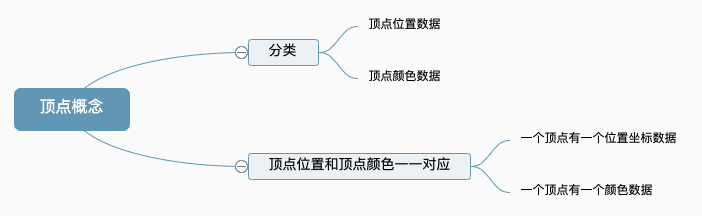

- 每个顶点设置一种颜色

```
//类型数组创建顶点颜色color数据
var colors = new Float32Array([
  1, 0, 0, //顶点1颜色
  0, 1, 0, //顶点2颜色
  0, 0, 1, //顶点3颜色

  1, 1, 0, //顶点4颜色
  0, 1, 1, //顶点5颜色
  1, 0, 1, //顶点6颜色
]);
// 设置几何体attributes属性的颜色color属性
geometry.attributes.color = new THREE.BufferAttribute(colors, 3); //3个为一组,表示一个顶点的颜色数据RGB
//材质对象
var material = new THREE.PointsMaterial({
  // 使用顶点颜色数据渲染模型，不需要再定义color属性
  // color: 0xff0000,
  vertexColors: THREE.VertexColors, //以顶点颜色为准
  size: 10.0 //点对象像素尺寸
});
```

- 属性缓冲区对象 BufferAttribute (创建各种各样顶点数据)

- 颜色插值(网格模型 Mesh 或者线模型 Line 构造函数的参数，你会发现渲染出渐变的彩色效果。)

### 顶点法向量数据光照计算

- 表示物体表面各个位置的法线方向，可以给几何体的每个顶点定义一个方向向量。

- 不设置顶点法向量数据 (点光源、平行光等带有方向性的光源不会起作用，三角形平面整个渲染效果相对暗淡，而且两个三角形分界位置没有棱角感。)

- 定义几何体顶点法向量数据

```
var normals = new Float32Array([
  0, 0, 1, //顶点1法向量
  0, 0, 1, //顶点2法向量
  0, 0, 1, //顶点3法向量

  0, 1, 0, //顶点4法向量
  0, 1, 0, //顶点5法向量
  0, 1, 0, //顶点6法向量
]);
// 设置几何体attributes属性的位置normal属性
geometry.attributes.normal = new THREE.BufferAttribute(normals, 3); //3个为一组,表示一个顶点的法向量数据
```

- API 使用总结

```
// 访问几何体顶点位置数据
BufferGeometry.attributes.position
// 访问几何体顶点颜色数据
BufferGeometry.attributes.color
// 访问几何体顶点法向量数据
BufferGeometry.attributes.normal
```

顶点法向量数据和几何体位置、颜色等顶点数据一样使用 BufferAttribute 表示。

### 顶点索引复用顶点数据

- 顶点索引.index

```
var geometry = new THREE.BufferGeometry(); //声明一个空几何体对象
//类型数组创建顶点位置position数据
var vertices = new Float32Array([
  0, 0, 0, //顶点1坐标
  80, 0, 0, //顶点2坐标
  80, 80, 0, //顶点3坐标
  0, 80, 0, //顶点4坐标
]);
// 创建属性缓冲区对象
var attribue = new THREE.BufferAttribute(vertices, 3); //3个为一组
// 设置几何体attributes属性的位置position属性
geometry.attributes.position = attribue
var normals = new Float32Array([
  0, 0, 1, //顶点1法向量
  0, 0, 1, //顶点2法向量
  0, 0, 1, //顶点3法向量
  0, 0, 1, //顶点4法向量
]);
// 设置几何体attributes属性的位置normal属性
geometry.attributes.normal = new THREE.BufferAttribute(normals, 3); //3个为一组,表示一个顶点的xyz坐标

// Uint16Array类型数组创建顶点索引数据
var indexes = new Uint16Array([
  // 0对应第1个顶点位置数据、第1个顶点法向量数据
  // 1对应第2个顶点位置数据、第2个顶点法向量数据
  // 索引值3个为一组，表示一个三角形的3个顶点
  0, 1, 2,
  0, 2, 3,
])
// 索引数据赋值给几何体的index属性
geometry.index = new THREE.BufferAttribute(indexes, 1); //1个为一组
```

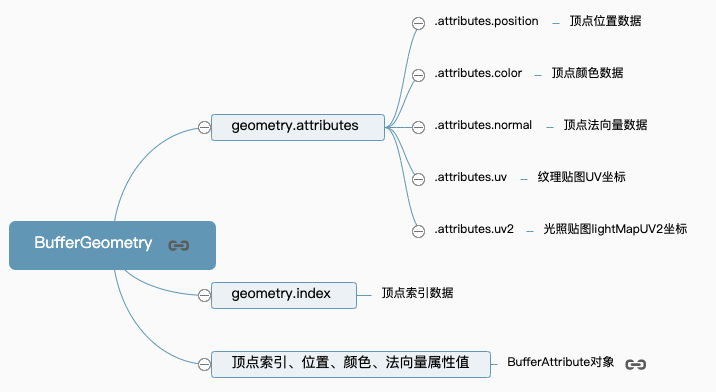

### Geometry 顶点位置、顶点颜色数据

- Vector3 定义顶点位置坐标数据(Vector3 是 threejs 的三维向量对象,可以通过 Vector3 对象表示一个顶点的 xyz 坐标，顶点的法线向量。)

```
var geometry = new THREE.Geometry(); //声明一个几何体对象Geometry
var p1 = new THREE.Vector3(50, 0, 0); //顶点1坐标
var p2 = new THREE.Vector3(0, 70, 0); //顶点2坐标
var p3 = new THREE.Vector3(80, 70, 0); //顶点3坐标
//顶点坐标添加到geometry对象
geometry.vertices.push(p1, p2, p3);
```

- Color 定义顶点颜色数据

```
// Color对象表示顶点颜色数据
var color1 = new THREE.Color(0x00ff00); //顶点1颜色——绿色
var color2 = new THREE.Color(0xff0000); //顶点2颜色——红色
var color3 = new THREE.Color(0x0000ff); //顶点3颜色——蓝色
//顶点颜色数据添加到geometry对象
geometry.colors.push(color1, color2, color3);
```

- 材质属性.vertexColors(vertexColors 设置为 THREE.VertexColors,这样顶点的颜色数据才能取代材质颜色属性.color 起作用。)

### Face3 对象定义 Geometry 的三角形面

- geometry.faces 和 BufferGeometry.index 类似都是顶点位置数据的索引值,用来组织网格模型三角形的绘制

```
var geometry = new THREE.Geometry(); //声明一个几何体对象Geometry

var p1 = new THREE.Vector3(0, 0, 0); //顶点1坐标
var p2 = new THREE.Vector3(0, 100, 0); //顶点2坐标
var p3 = new THREE.Vector3(50, 0, 0); //顶点3坐标
var p4 = new THREE.Vector3(0, 0, 100); //顶点4坐标
//顶点坐标添加到geometry对象
geometry.vertices.push(p1, p2, p3,p4);

// Face3构造函数创建一个三角面
var face1 = new THREE.Face3(0, 1, 2);
//三角面每个顶点的法向量
var n1 = new THREE.Vector3(0, 0, -1); //三角面Face1顶点1的法向量
var n2 = new THREE.Vector3(0, 0, -1); //三角面2Face2顶点2的法向量
var n3 = new THREE.Vector3(0, 0, -1); //三角面3Face3顶点3的法向量
// 设置三角面Face3三个顶点的法向量
face1.vertexNormals.push(n1,n2,n3);
// 设置三角面face1三个顶点的颜色
face1.vertexColors = [
  new THREE.Color(0xffff00),
  new THREE.Color(0xff00ff),
  new THREE.Color(0x00ffff),
]

// 三角面2
var face2 = new THREE.Face3(0, 2, 3);
// 设置三角面法向量
face2.normal=new THREE.Vector3(0, -1, 0);
// 三角形face2颜色
face2.color = new THREE.Color(0xffff00);

//三角面face1、face2添加到几何体中
geometry.faces.push(face1,face2);
```

### 访问几何体对象的数据

- 像访问 javascript 对象的属性一样

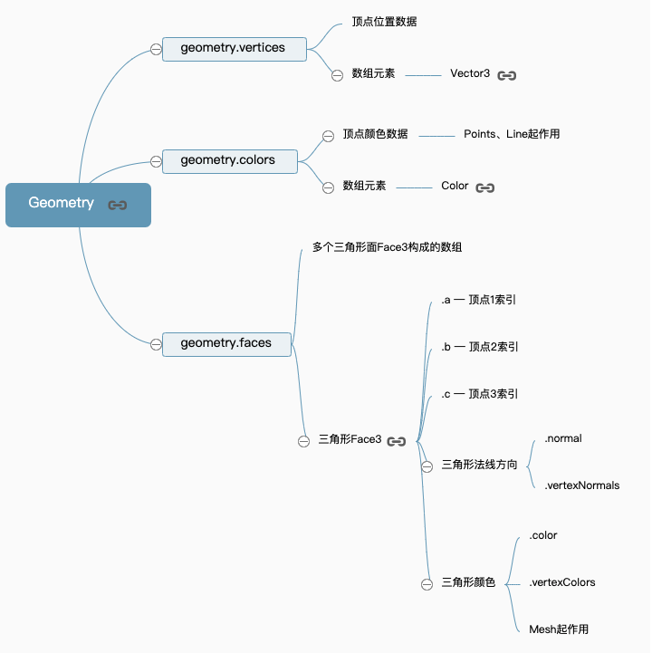

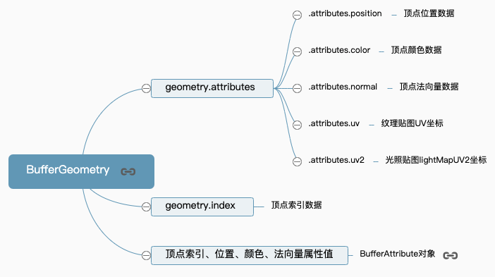

### 几何体旋转、缩放、平移变换

```
var geometry = new THREE.BoxGeometry(100, 100, 100); //创建一个立方体几何对象Geometry
// 几何体xyz三个方向都放大2倍
geometry.scale(2, 2, 2);
// 几何体沿着x轴平移50
geometry.translate(50, 0, 0);
// 几何体绕着x轴旋转45度
geometry.rotateX(Math.PI / 4);
// 居中：偏移的几何体居中
geometry.center();
console.log(geometry.vertices);
```

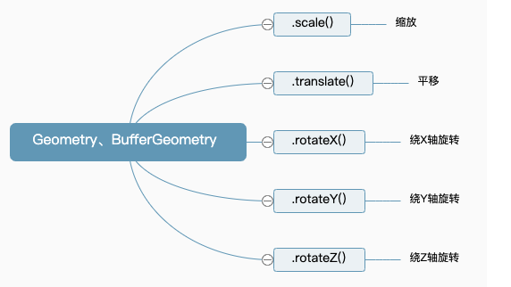

## 材质对象

### 常用材质

- 点材质 PointsMaterial
- 基础线材质 LineBasicMaterial / 虚线材质 LineDashedMaterial。
- 网格模型 比较多

  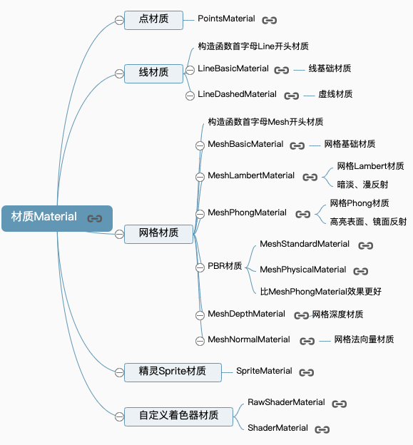

- 材质和模型对象对应关系

  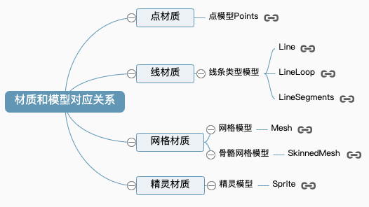

### 材质共有属性、私有属性

- .side 属性 -- 属性值定义面的渲染方式前面后面 或 双面

- 材质透明度.opacity -- 设置材质的透明程度

- 大多材质都是父类 Material 的子类

## 点线面模型对象

### 点、线、网格模型介绍

- 点模型 Points

```
var geometry = new THREE.BoxGeometry(100, 100, 100); //创建一个立方体几何对象Geometry
// 点渲染模式
var material = new THREE.PointsMaterial({
  color: 0xff0000,
  size: 5.0 //点对象像素尺寸
}); //材质对象
var points = new THREE.Points(geometry, material); //点模型对象
```

- 线模型 Line

```
var geometry = new THREE.BoxGeometry(100, 100, 100); //创建一个立方体几何对象Geometry
// 线条渲染模式
var material=new THREE.LineBasicMaterial({
    color:0xff0000 //线条颜色
});//材质对象
// 创建线模型对象   构造函数：Line、LineLoop、LineSegments
var line=new THREE.Line(geometry,material);//线条模型对象
```

- 网格模型 Mesh

```
var geometry = new THREE.BoxGeometry(100, 100, 100);
// 三角形面渲染模式
var material = new THREE.MeshLambertMaterial({
  color: 0x0000ff, //三角面颜色
  wireframe:true,//网格模型以线条的模式渲染
}); //材质对象
var mesh = new THREE.Mesh(geometry, material); //网格模型对象Mesh
```

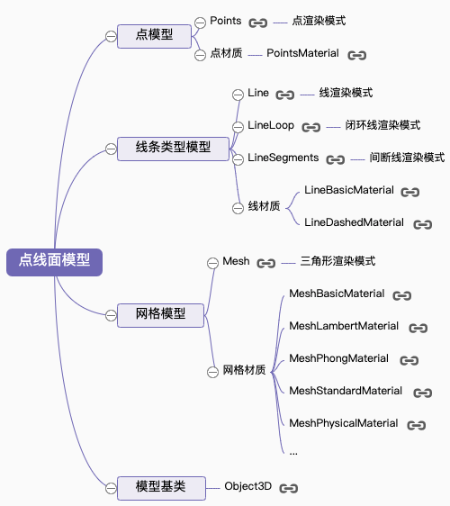

### 模型对象旋转平移缩放变换

- 点模型 Points、线模型 Line、网格网格模型 Mesh 等模型对象的基类都是 Object3D

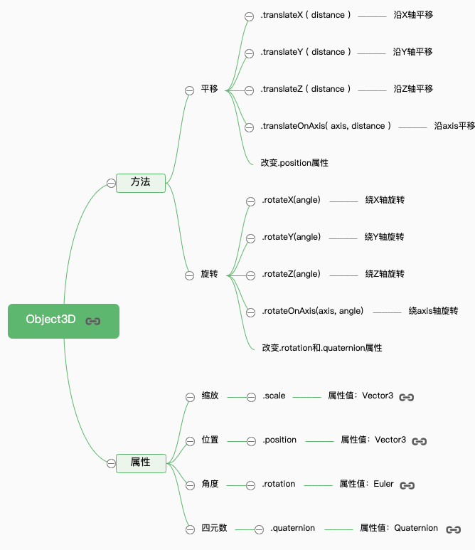

### 对象克隆.clone()和复制.copy()

- 复制方法.copy()

```
var p1 = new THREE.Vector3(1.2,2.6,3.2);
var p2 = new THREE.Vector3(0.0,0.0,0.0);
p2.copy(p1)
// p2向量的xyz变为p1的xyz值
console.log(p2);
```

- 克隆方法.clone()

```
var p1 = new THREE.Vector3(1.2,2.6,3.2);
var p2 = p1.clone();
// p2对象和p1对象xyz属性相同
console.log(p2);
```

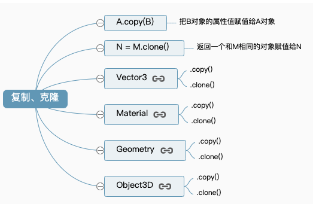

## 光源对象

### 常见光源

- 环境光 AmbientLight
- 点光源 PointLight
- 平行光 DirectionalLight
- 聚光源 SpotLight
- 光源辅助对象
  - 聚光源辅助对象 SpotLightHelper
  - 点光源辅助对象 PointLightHelper
  - 平行光光源辅助对象 DirectionalLightHelper
- 光照计算算法 (mesh.material.color 和 light.color 进行相乘)

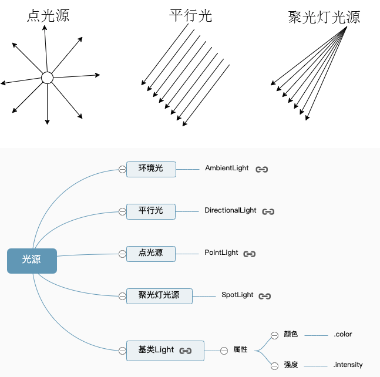

### 光照阴影计算

主要设置三部分，一个是设置产生投影的模型对象，一个是设置接收投影效果的模型，最后一个是光源对象本身的设置，光源如何产生投影

- 平行光投影计算代码

```
var geometry = new THREE.BoxGeometry(40, 100, 40);
var material = new THREE.MeshLambertMaterial({
  color: 0x0000ff
});
var mesh = new THREE.Mesh(geometry, material);
// mesh.position.set(0,0,0)
scene.add(mesh);

// 设置产生投影的网格模型
mesh.castShadow = true;


//创建一个平面几何体作为投影面
var planeGeometry = new THREE.PlaneGeometry(300, 200);
var planeMaterial = new THREE.MeshLambertMaterial({
  color: 0x999999
});
// 平面网格模型作为投影面
var planeMesh = new THREE.Mesh(planeGeometry, planeMaterial);
scene.add(planeMesh); //网格模型添加到场景中
planeMesh.rotateX(-Math.PI / 2); //旋转网格模型
planeMesh.position.y = -50; //设置网格模型y坐标
// 设置接收阴影的投影面
planeMesh.receiveShadow = true;

// 方向光
var directionalLight = new THREE.DirectionalLight(0xffffff, 1);
// 设置光源位置
directionalLight.position.set(60, 100, 40);
scene.add(directionalLight);
// 设置用于计算阴影的光源对象
directionalLight.castShadow = true;
// 设置计算阴影的区域，最好刚好紧密包围在对象周围
// 计算阴影的区域过大：模糊  过小：看不到或显示不完整
directionalLight.shadow.camera.near = 0.5;
directionalLight.shadow.camera.far = 300;
directionalLight.shadow.camera.left = -50;
directionalLight.shadow.camera.right = 50;
directionalLight.shadow.camera.top = 200;
directionalLight.shadow.camera.bottom = -100;
// 设置mapSize属性可以使阴影更清晰，不那么模糊
// directionalLight.shadow.mapSize.set(1024,1024)
console.log(directionalLight.shadow.camera);
```

- 聚光光源投影计算代码

```
// 聚光光源
var spotLight = new THREE.SpotLight(0xffffff);
// 设置聚光光源位置
spotLight.position.set(50, 90, 50);
// 设置聚光光源发散角度
spotLight.angle = Math.PI /6
scene.add(spotLight); //光对象添加到scene场景中
// 设置用于计算阴影的光源对象
spotLight.castShadow = true;
// 设置计算阴影的区域，注意包裹对象的周围
spotLight.shadow.camera.near = 1;
spotLight.shadow.camera.far = 300;
spotLight.shadow.camera.fov = 20;
```

- 模型.castShadow 属性 -- 设置一个模型对象是否在光照下产生投影效果
- .receiveShadow 属性 -- 设置一个模型对象是否在光照下接受其它模型的投影效果
- 光源.castShadow 属性 -- 光源将投射动态阴影
- 光源.shadow 属性
- 阴影对象基类 LightShadow -- (LightShadow 属性.camera: 观察光源的相机对象;LightShadow 属性.mapSize: 定义阴影纹理贴图宽高尺寸的一个二维向量 Vector2; LightShadow 属性.map: WebGL 渲染目标对象 WebGLRenderTarget )

### 基类 Light 和 Object3D

- 光源位置属性
- 光源颜色属性.color
- 强度属性.intensity
- 光源对象继承了父类 Object3D

## 层级模型、树结构

## 组对象 Group、层级模型

- Group 案例

```
//创建两个网格模型mesh1、mesh2
var geometry = new THREE.BoxGeometry(20, 20, 20);
var material = new THREE.MeshLambertMaterial({color: 0x0000ff});
var group = new THREE.Group();
var mesh1 = new THREE.Mesh(geometry, material);
var mesh2 = new THREE.Mesh(geometry, material);
mesh2.translateX(25);
//把mesh1型插入到组group中，mesh1作为group的子对象
group.add(mesh1);
//把mesh2型插入到组group中，mesh2作为group的子对象
group.add(mesh2);
//把group插入到场景中作为场景子对象
scene.add(group);
```

- 查看子对象.children

- .add()方法

- .remove()方法

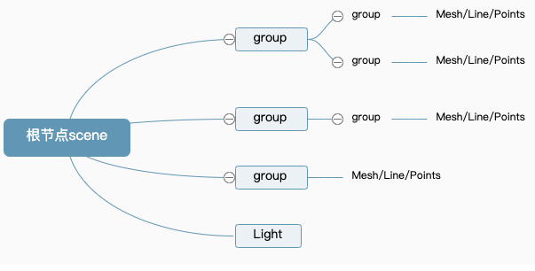

### 层级模型节点命名、查找、遍历

- 模型命名(.name 属性)

- 树结构层级模型

- 递归遍历方法.traverse()

- 查找某个具体的模型 -- .getObjectById()、.getObjectByName()等方法

```
// 遍历查找scene中复合条件的子对象，并返回id对应的对象
var idNode = scene.getObjectById ( 4 );
console.log(idNode);
/ 遍历查找对象的子对象，返回name对应的对象（name是可以重名的，返回第一个）
var nameNode = scene.getObjectByName ( "左腿" );
nameNode.material.color.set(0xff0000);
```

### 世界坐标.getWorldPosition()

- 本地坐标系或者说模型坐标系，就是模型对象相对模型的父对象而言，模型位置属性.position 表示的坐标值就是以本地坐标系为参考

- 世界坐标系默认就是对 Threejs 整个场景 Scene 建立一个坐标系，一个模型相对世界坐标系的坐标值就是该模型对象所有父对象以及模型本身位置属性.position 的叠加。

- .getWorldPosition()方法

```
// 声明一个三维向量用来保存世界坐标
var worldPosition = new THREE.Vector3();
// 执行getWorldPosition方法把模型的世界坐标保存到参数worldPosition中
mesh.getWorldPosition(worldPosition);
```

- 本地缩放系数.scale / .getWorldScale()方法可以获得一个模型的世界缩放系数

- 本地矩阵.materix 和世界矩阵.matrixWorld

## 几何体对象、曲线、三维模型

### 常见几何体和曲线 API

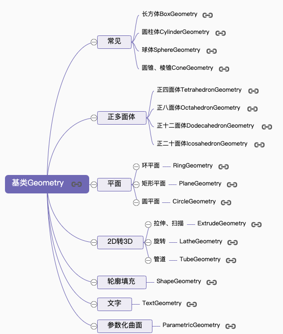

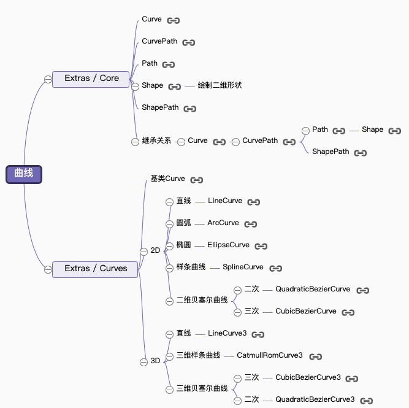

### 直线、椭圆、圆弧、基类 Curve

- 圆弧线 ArcCurve
- 曲线 Curve 方法.getPoints()
- 几何体方法.setFromPoints()
- LineCurve 绘制一条二维直线
- LineCurve3 绘制一条三维直线

### 样条曲线、贝赛尔曲线

### 多个线条组合曲线 CurvePath

组合曲线 CurvePath 可以把多个圆弧线、样条曲线、直线等多个曲线合并成一个曲线
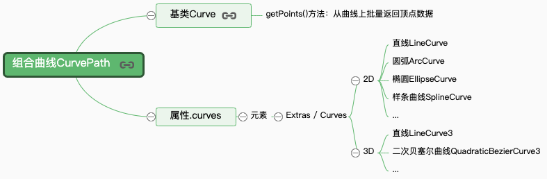

### 曲线路径管道成型 TubeGeometry

- TubeGeometry 的功能就是通过一条曲线生成一个圆管

### 旋转造型 LatheGeometry

- LatheGeometry 可以利用已有的二维数据生成三维顶点数据，二维数据可以通过二维向量对象 Vector2 定义，也可以通过 3D 曲线或 2D 线条轮廓生成

### Shape 对象和轮廓填充 ShapeGeometry

- 填充顶点构成的轮廓
- shape 外轮廓和内轮廓
- 多个轮廓同时填充
- 边界坐标填充轮廓

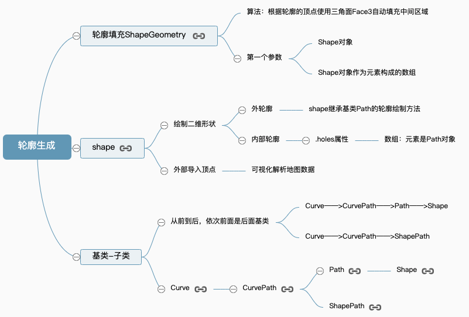

### 拉伸扫描成型 ExtrudeGeometry

- ExtrudeGeometry()可以利用 2D 轮廓生成 3D 模型

## 纹理贴图

### 创建纹理贴图

- TextureLoader 的 load()方法加载一张图片可以返回一个纹理对象 Texture，纹理对象 Texture 可以作为模型材质颜色贴图.map 属性的值

  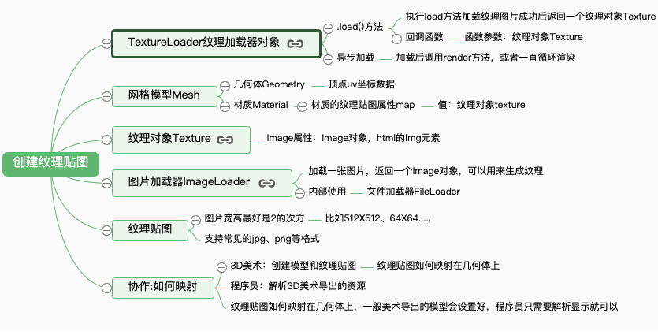

### 顶点纹理坐标 UV

- 纹理坐标含义就是一面意思，一张纹理贴图图像的坐标

- 纹理 UV 坐标和顶点位置坐标是一一对应关系

- 几何体有两组 UV 坐标，第一组组用于.map、.normalMap、.specularMap 等贴图的映射，第二组用于阴影贴图.lightMap 的映射

- 修改纹理坐标

- Geometry 自定义顶点 UV 坐标

- BufferGeometry 自定义顶点 UV 坐标

- 加载一个包含 UV 坐标的模型文件

  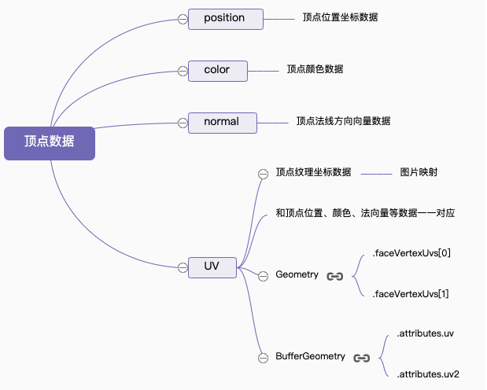

### 数组材质、材质索引.materialIndex

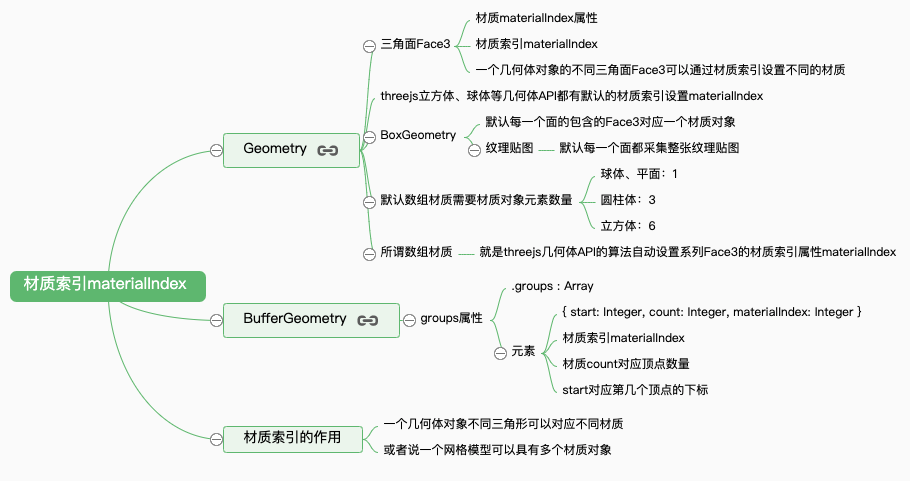

### 纹理对象 Texture 阵列、偏移、旋转

- 阵列 THREE.RepeatWrapping;
- 偏移 texture.offset
- 纹理旋转

```
// 设置纹理旋转角度
texture.rotation = Math.PI/4;
// 设置纹理的旋转中心，默认(0,0)
texture.center.set(0.5,0.5);
```

- 纹理动画 在渲染函数中 render()一直执行 texture.offset.x -= 0.06 动态改变纹理对象 Texture 的偏移属性.offset 就可以

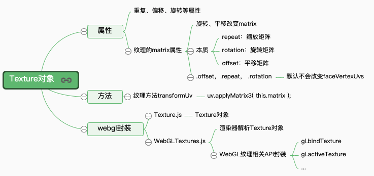

### canvas 画布、视频作为纹理贴图

- Canvas 画布作为 Three.js 纹理贴图(CanvasTexture)
- 视频作为 Three.js 纹理贴图(VideoTexture)

### 凹凸贴图 bumpMap 和法线贴图.normalMap

- 法线贴图 凹陷效果
- 凹凸贴图 凹凸贴图是用图片像素的灰度值表示几何表面的高低深度,没有法线贴图表达的几何体表面信息丰富

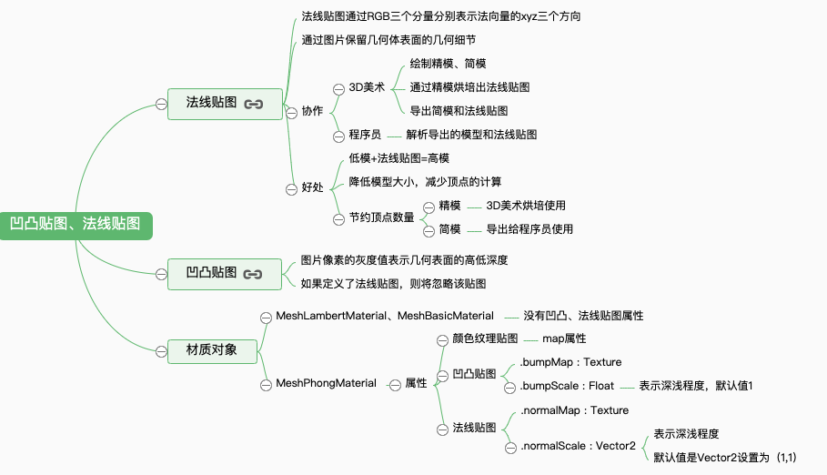

### 光照贴图添加阴影(·lightMap)

- 设置模型的阴影，也就是阴影贴图或者说光照贴图·lightMap，一般 Threejs 加载外部模型的光照贴图·lightMap，三维模型加载器可以自动设置

- Geometry 属性.faceVertexUvs Geometry.faceVertexUvs[0]包含的纹理坐标用于颜色贴图 map、法线贴图 normalMap 等,Geometry.faceVertexUvs[1]包含的第二套纹理贴图用于光照阴影贴图

- BufferGeometry 属性.uv 和.uv2

### 高光贴图(.specularMap)

- 高光贴图属性.specularMap 和高光属性.specular 是对应的

### 环境贴图(.envMap)

- .envMap 字面意思就是三维模型周边环境。创建一个立方体盒子作为天空盒使用，然后把一个环境中上下左右前后六张视图图片作为立方体盒子的纹理贴图使用。

### 数据纹理对象 DataTexture

- 通过程序创建纹理贴图的每一个像素值。

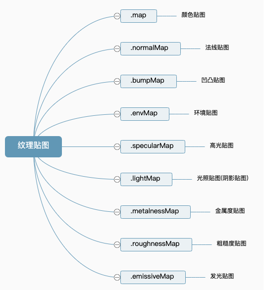

## 相机对象

### 正投影相机 OrthographicCamera 和透视投影相机 PerspectiveCamera

```
// 正投影相机对象OrthographicCamera
OrthographicCamera( left, right, top, bottom, near, far )
// 透视投影相机PerspectiveCamera
PerspectiveCamera( fov, aspect, near, far )
```

- .posiiotn 可以设置相机的位置。
- .lookAt()方法用来指定相机拍摄对象的坐标位置

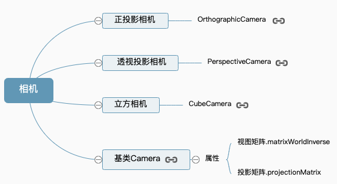

### 浏览器窗口尺寸变化(自适应渲染)

- 视图矩阵.matrixWorldInverse 和投影矩阵.projectionMatrix

```
// onresize 事件会在窗口被调整大小时发生
window.onresize=function(){
  // 重置渲染器输出画布canvas尺寸
  renderer.setSize(window.innerWidth,window.innerHeight);
  // 重置相机投影的相关参数
  k = window.innerWidth/window.innerHeight;//窗口宽高比
  camera.left = -s*k;
  camera.right = s*k;
  camera.top = s;
  camera.bottom = -s;
  // 渲染器执行render方法的时候会读取相机对象的投影矩阵属性projectionMatrix
  // 但是不会每渲染一帧，就通过相机的属性计算投影矩阵(节约计算资源)
  // 如果相机的一些属性发生了变化，需要执行updateProjectionMatrix ()方法更新相机的投影矩阵
  camera.updateProjectionMatrix ();
};
window.onresize=function(){
  // 重置渲染器输出画布canvas尺寸
  renderer.setSize(window.innerWidth,window.innerHeight);
  // 全屏情况下：设置观察范围长宽比aspect为窗口宽高比
  camera.aspect = window.innerWidth/window.innerHeight;
  // 渲染器执行render方法的时候会读取相机对象的投影矩阵属性projectionMatrix
  // 但是不会每渲染一帧，就通过相机的属性计算投影矩阵(节约计算资源)
  // 如果相机的一些属性发生了变化，需要执行updateProjectionMatrix ()方法更新相机的投影矩阵
  camera.updateProjectionMatrix ();
};
```

## 精灵模型、粒子系统

### 精灵模型 Sprite

- 精灵模型对象本质上可以理解为已经内部封装了一个平面矩形几何体 PlaneGeometry，矩形精灵模型与矩形网格模型的区别在于精灵模型的矩形平面会始终平行于 Canvas 画布

- SpriteMaterial 和普通的网格材质一样可以设置颜色.color、颜色贴图.map、开启透明.transparent、透明度.opacity 等属性, 还有一些自己独特的方法和属性，

- .scale 和.position

- Sprite 用途: 把精灵模型作为一个模型的标签，标签上可以显示一个写模型的信息，你可以通过足够多的精灵模型对象，构建一个粒子系统，来模拟一个下雨、森林、或下雪的场景效果。

### 精灵模型 案例

## 帧动画模块

### 编辑关键帧并解析播放

- API： 关键帧 KeyframeTrack、剪辑 AnimationClip、操作 AnimationAction、混合器 AnimationMixer。

- 编辑关键帧 关键帧 KeyframeTrack 和剪辑 AnimationClip
- 播放关键帧 操作 AnimationAction 和混合器 AnimationMixer

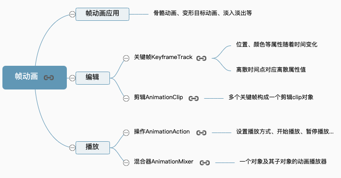

### 解析外部模型的帧动画

- 关键帧数据

- 播放模型帧动画

- 播放设置

### 播放设置(暂停、时间段、时间点)

- 播放/暂停(.paused 属性)

- 播放 clip 特定时间段

- 定位在某个时间点

- 快进(按钮递增时间点)

- 滚动条拖动播放帧动画

## 骨骼动画、变形动画

### 骨骼动画(SkinnedMesh)

- 通过骨骼网格模型类 SkinnedMesh 来实现，一般来说骨骼动画模型都是 3D 美术创建，然后程序员通过 threejs 引擎加载解析

- 相关类 直接使用 Threejs 编写一个骨骼动画还是比较复杂
  - Bone
  - 骨架 Skeleton
  - Geometry(.skinWeights 和.skinIndices 属性)
  - 骨骼网格模型 SkinnedMesh
  - 程序创建一个骨骼动画
  - 程序实现骨骼动画
  - 解析外部骨骼动画模型
  - 皮肤顶点权重属性.skinWeights
  - 顶点索引属性.skinIndices
  - 骨骼动画顶点数据

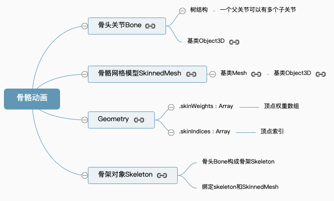

### 加载外部模型骨骼动画

- 先加载外部的三维模型，查看骨骼动画相关的数据，解析渲染骨骼动画。

### 变形动画 geometry.morphTargets

- 变形动画和骨骼动画一样，由 3D 美术编辑好变形动画的模型数据，然后程序员通过 Threejs 相关的 API 解析渲染变形动画。

- 创建变形动画的顶点数据，生成变形动画，

### 解析外部模型变形动画目标数据

- geometry.morphTargets 可以查看模型的变形数据。
- 网格模型的.morphTargetInfluences 属性赋予不同的值
- 通过混合器 AnimationMixer 获取模型中的变形动画关键帧数据然后进行播放。

## 语音模块

- 对原生 Web Audio API 的封装提供了一些方便大家使用的语音模块
- 相关的 API：音频 Audio、位置音频 PositionalAudio、监听者 AudioListener、音频分析器 AudioAnalyser、音频加载器 AudioLoader。
- 非位置音频 THREE.Audio，背景音乐
- 位置音频 THREE.PositionalAudio，不同位置音源的声音效果
- 音乐可视化，查看音频的频率数据然后可视化

## 加载外部模型文件

### 数据结构、导入导出

- Threejs 导出模型信息： .toJSON()通过这个方法可以导出 Threejs 三维模型的各类数据

- 自定义模型加载器文件： 加载器本质上都是解析模型文件的字符串，通过正则表达式提取相关的顶点、材质等信息转化为 Threejs 自身的类表示的对象

```
// 创建一个文件加载器，该加载器是对异步加载的封装
var loader = new THREE.FileLoader();
```

- 加载 Three.js 导出的模型数据

```
// 缓冲几何体数据加载器
var loader = new THREE.BufferGeometryLoader();
// 网格模型Mesh加载，包含几何体Geometry和材质Material
var loader = new THREE.ObjectLoader();
```

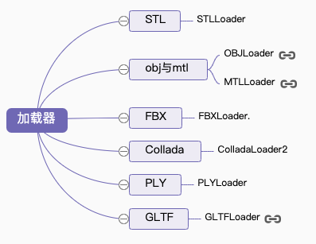

### .stl 格式模型加载

- .stl 格式的三维模型不包含材质 Material 信息，只包含几何体顶点数据的信息，你可以简单地把 stl 文件理解为几何体对象 Geometry

- 通过 STLLoader.js 加载.stl 文件

### .obj 模型文件加载

- 同时导出一个材质文件.mtl， .obj 和.stl 文件包含的信息一样都是几何体顶点相关数据，材质文件.mtl 包含的是模型的材质信息，比如颜色、贴图路径等。

- OBJLoader / MTLLoader

- .obj 文件不包含场景的相机 Camera、光源 Light 等信息，不能导出骨骼动画、变形动画，如果希望导出光照信息、相机信息、骨骼动画信息、变形动画信息，可以选择.fbx、.gltf 等格式。

### 加载 FBX 并解析骨骼动画

- FBXLoader
- 加载 fbx 模型文件 / 查看 FBX 模型帧动画数据 / 解析 fbx 模型骨骼动画

### 手镯预览案例 / 心脏预览(法线、高光贴图)案例

## WebGL 渲染器

### 全屏渲染

- WebGLRenderer 的.setSize()方法设置渲染尺寸为浏览器 body 区域宽高度。

### 局部渲染

- 通过渲染结果.domElement(Canvas 元素)的父元素 div 来控制渲染区域在浏览器上的位置

- .setSize()方法简单解释就是设置渲染结果的尺寸范围，本质上就是设置.domElement 表示的 canvas 画布的宽高尺寸。

### 相机控件 OrbitControls 作用范围

- 如果渲染区域变化了，不仅仅要改变 WebGL 渲染器相关参数，如果使用的其它扩展库与 Threejs 渲染范围有关，比如 OrbitControls.js，，也需要设置该控件的鼠标作用范围
